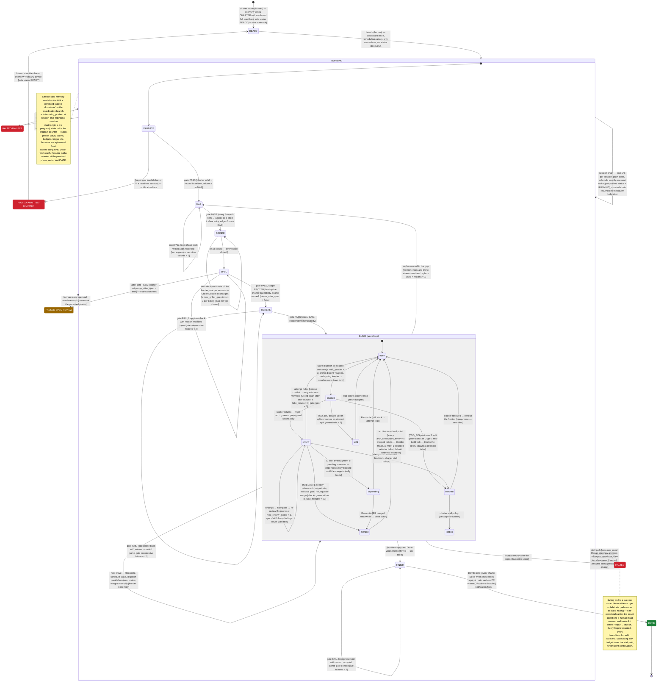

# Control flow — the run's state machine

A state-machine map of the autopilot run, derived **only** from this folder's
files (SKILL.md **Version 1.0**, state `schema: 1`). State names are the exact
vocabulary the run persists: `state.md`'s `status:` and `phase:` values, and the
ticket files' `status:` values (see `references/formats.md`). Guards quote or
closely paraphrase the skill text; the traceability table below maps every state
and edge to its source. Line numbers refer to the files at the repo revision
this document was authored against (`23384e3`). This is a map, not a normative
source — where it and SKILL.md disagree, SKILL.md wins.

States are the configurations a run can be in **between** sessions. Composite
nesting mirrors loop nesting: the session chain (RUNNING) contains the wave loop
(BUILD), which contains the per-ticket cycles. Terminal styling: green = success,
red = halted (human needed), amber = paused (human re-arms).

## What is deliberately NOT a state

- **preflight** — proves the environment but writes no `status:`; it only gates
  `launch` socially ("Offer `launch` on full pass", operations.md L183).
- **claims** — the `claim:` field is an intra-session mutex (rejected push →
  exit quietly; stale after `max_session_minutes` → adoptable), not a phase
  (SKILL.md L75-77).
- **Griller / Decider / red-team / Auditor** — subagent roles inside one
  session; their loop bound (`max_griller_questions`) appears on the DECIDE
  self-loop (SKILL.md L191-224).
- **Lane A / lane B scheduling, canary, babysitter** — runner machinery that
  keeps the chain alive; it never changes `status:` except via the guards shown
  (operations.md L35-124).

## Traceability

Sources: `S` = SKILL.md, `F` = references/formats.md, `O` =
references/operations.md, `P` = references/playbooks.md, `I` =
references/interview-guide.md, `C` = references/charter-template.md.
Flags: **⚑ inferred/paraphrase** (not verbatim in the skill text — kept because
the complement or mechanism is explicit; see footnotes), **✱ resume synthesis**
(edge is explicit; the "resume at persisted phase" detail is synthesized from
state.md being the program counter, S L60).

### States

| State | Vocabulary source | Defined at |
| --- | --- | --- |
| `READY` | `status:` enum, F L14 | S §Modes L32 (charter's one state edit); I §Output L194-196 |
| `RUNNING` | `status:` enum, F L14 | S §Modes L34, L36; F L36-38 (run mode only moves RUNNING → RUNNING, PAUSED-SPEC-REVIEW, DONE, HALTED\*) |
| `PAUSED-SPEC-REVIEW` | `status:` enum, F L14 | S §Phase machine L138-140 |
| `DONE` | `status:` enum, F L14 | S §Phase machine (FINISH) L186-189 |
| `HALTED` | `status:` enum, F L15 | S L20-22 ("Halting well is a success state"), L111-112 |
| `HALTED-AWAITING-CHARTER` | `status:` enum, F L15 | S §Phase machine (VALIDATE) L116-117 |
| `HALTED-BY-USER` | `status:` enum, F L15 | S §Modes L37; O §Stop L219 |
| `VALIDATE` `MAP` `DECIDE` `SPEC` `TICKETS` `BUILD` `FINISH` | `phase:` enum, F L16 | S §Phase machine L114, L121, L130, L133, L143, L149, L186 |
| `open` `claimed` `review` `ci-pending` `merged` `blocked` `split` `icebox` | ticket `status:` enum, F L45 | F §Ticket file L40-66 |

### Edges and guards

| Edge | Guard (as drawn) | Source | Basis |
| --- | --- | --- | --- |
| `[*] → READY` | confirmed full read-back | S L32; I L188-199 | "on confirmed read-back sets `status: READY` (its one state edit)" |
| `READY → RUNNING` | launch (human) | S L34; O §Launch L185-213 | "Set `status: RUNNING` (from READY / a repaired HALT / PAUSED-SPEC-REVIEW)" |
| `RUNNING → RUNNING` (session chain) | [just-pushed status = RUNNING], one wake; babysitter resumes crashes | S L102-105, L240-245; O §Guards L111-113 | "schedule only when `status: RUNNING`, only **after** state is successfully pushed, and only **one** next session" |
| `VALIDATE → MAP` | gate PASS | S L118-119 | "Valid → record baselines, advance to MAP"; checklist F L93-101 |
| `VALIDATE → HALTED-AWAITING-CHARTER` | [missing/invalid charter, headless] | S L115-118 | "Missing/invalid charter in a headless session → `HALTED-AWAITING-CHARTER` + notification" |
| `MAP → MAP`, `SPEC → SPEC`, `TICKETS → TICKETS`, `FINISH → FINISH` | [same-gate consecutive failures < 2] | S L110-112 | "A failed gate loops the phase back with the reason recorded"; default `consecutive_same_gate_failures 2` S L236 |
| `MAP → DECIDE` | [Scope-In → node or cited icebox entry, edges form a DAG] | S L126-128 | gate quoted verbatim; checklist F L103-107 |
| `DECIDE → DECIDE` | [map not yet closed], [≤ max_griller_questions = 7] | S L129-131, L203-204; P §5 L129-131 | "one per session"; "loop ≤ `max_griller_questions`" |
| `DECIDE → SPEC` | [map closed — every node closed] | S L131-132 | "Close the map when every node is closed." |
| `SPEC → TICKETS` | [traceability, seams named] [pause_after_spec = false] | S L135-138; C L62 | "line-by-line charter traceability …, seams named. **After this gate scope is FROZEN**" |
| `SPEC → PAUSED-SPEC-REVIEW` | [pause_after_spec = true] | S L138-140 | "If the charter set `pause_after_spec: true` → `PAUSED-SPEC-REVIEW` + notification" |
| `PAUSED-SPEC-REVIEW → RUNNING` ✱ | human reads spec.md → launch | S L140-141; O L211-215 | "the human reads spec.md … and re-arms via `launch`" |
| `TICKETS → BUILD` | [sizes, DAG, independent mergeability] | S L146-147 | gate quoted verbatim; checklist F L116-120 |
| `BUILD → BUILD` (wave loop) | [frontier not empty] | S L149-174; exit complement L183-184 | wave steps 1-5 ("Reconcile … Schedule the wave … Dispatch … Review … Integrate serially") |
| `open → claimed` | [≤ max_parallel = 3, disjoint Touches, down to 1] | S L152-158 | "pick up to `max_parallel` frontier tickets … Overlapping frontier → smaller wave, down to 1" |
| `claimed → review` | worker returns | S L156-164; P §3-4 | worker TDD loop, then "Review each returned ticket" |
| `review → review` | [fix rounds ≤ max_review_cycles = 2] | S L164-165; P §4 L120-122 | "≤ `max_review_cycles` fix rounds"; "spec-faithfulness findings are unwaivable" |
| `review → merged` | [checks green ≤ ci_wait_minutes = 20] | S L166-170; F §INTEGRATE L122-131 | "rebase … full local gate … push branch → open PR … wait on checks ≤ `ci_wait_minutes` → squash-merge" |
| `review → ci-pending` | CI timeout | S L173-174 | "Timeout → mark `ci-pending`, move on; dependents stay blocked until the merge actually lands" |
| `review → open` | [rebase conflict → solo next wave] / [CI red after one fix push, ≤ flake_reruns = 1] [attempts < 3] | S L171-173, L236; O L144 | "Rebase conflict → drop from this wave, retry solo next wave (counts an attempt). CI red → diagnose from logs, one fix push; red again → attempt failed" |
| `review → blocked` | [attempts 3/3] | S L175 | "Attempts: 3 per ticket, then `blocked` + the charter's stall policy" |
| `claimed → split` | [split consumes an attempt, generations ≤ 2] | S L176-177; P §3 L85-89 | "A clean `TOO_BIG` split consumes an attempt; sub-tickets get fresh budgets" |
| `split → open` | [fresh budgets] | S L176-177 | "sub-tickets get fresh budgets" |
| `claimed → blocked` | [past 2 split generations] / [Type 1 fork] | S L177, L218-219; P L82-84 | "max 2 split generations, then blocked"; "anything Type 1 blocks the ticket and spawns a decision ticket" |
| `ci-pending → merged` | [merged meanwhile] | S L150-152 | "resolve any `ci-pending` PRs (merged meanwhile → close tickets …)" |
| `ci-pending → open` | [still stuck → attempt logic] | S L150-152 | "… still stuck → attempt logic" |
| `blocked → open` ⚑ | blocker resolved → refresh the frontier | S L152, L174; P L82-84 | paraphrase — see footnote 2 |
| `blocked → icebox` | [stall policy descope-to-icebox] | C §Stall policy L45-49; S L175 | "Ticket blocked after max attempts: `descope-to-icebox` \| `leave-blocked`" (leave-blocked = no edge) |
| `merged → open` (checkpoint) | [every arch_checkpoint_every = 5 merged, ≤ 1 bounded refactor] | S L178-181; P §6 L135-159 | "triaged by the Decider into blocking-task / bounded-refactor / icebox — the only lawful ways scope moves"; "at most ONE refactor ticket per checkpoint" |
| `BUILD → MAP` (replan) | [frontier empty and Done-when unmet and replans < 1] | S L183-184, L234 | "Frontier empty but Done-when unmet → one replan pass (back to MAP, scoped to the gap; consumes the replan budget)" |
| `BUILD → HALTED` | [frontier empty after replan budget spent] | S L184 | "Empty after that → HALT." |
| `BUILD → FINISH` ⚑ | [frontier empty and Done-when met] | inferred | see footnote 1 |
| `FINISH → DONE` | [Done-when passes on main, archive PR, Routines disabled] | S L186-189; F §DONE L132-135 | "`status: DONE` (notification fires)" |
| `RUNNING → HALTED` | [two consecutive failures of the same gate] | S L111-112 | quoted verbatim; tracked per gate in `gate_failures:` F L24 — see footnote 3 |
| `RUNNING → HALTED` | [sessions cap / max_hours / no_progress_sessions = 3] | S L229-231, L243-245; O §Guards L114-116 | "exhausting any budget takes the stall path, never silent continuation"; "→ HALT instead of scheduling" |
| `RUNNING → HALTED` | [unanswerable question / unknown schema] | S L222-224; F L5-6; O L126-132 | "If a question cannot be answered safely → HALT"; "a session that reads a schema it doesn't know must HALT, not guess" |
| `RUNNING → HALTED-BY-USER` | stop mode, immediate | S L37, L267-268; O §Stop L217-227 | "at any point, if state says `HALTED-BY-USER`, finish the current write-back and exit" |
| `HALTED → RUNNING` ✱ | Repair → launch (human) | S L34, L39-41; F L193-195; O L211-215 | "Resume: run /autopilot in any session — it will offer the Repair interview, then launch" |
| `HALTED-BY-USER → RUNNING` ✱ | Repair → launch (human) | O L224-226 | "`/autopilot` will offer Repair → launch whenever they want to resume" |
| `HALTED-AWAITING-CHARTER → READY` | charter interview (human) | S L117-118, L32 | "the human runs the charter interview from any device"; charter sets READY |
| `DONE → [*]` | terminal | S L94-96; F L36-38 | "Terminal status (`DONE`, any `HALTED*`, `PAUSED*`)? Report, verify the Routines are disabled, exit" |

**Footnotes**

1. **`BUILD → FINISH` is inferred**, not quoted: SKILL.md L183-184 defines what
   happens when the frontier is empty and Done-when is *unmet* (replan, then
   HALT); no sentence states the complementary transition. FINISH's definition
   (L186-189, "every charter Done-when command against `main`") and the DONE
   gate (F L132-135) confirm FINISH is where a met Done-when is verified, so the
   guard shown is the documented exits' complement.
2. **`blocked → open` is a close paraphrase**: no sentence says a blocked ticket
   re-opens. It is composed from "refresh the frontier" (S L152), "dependents
   stay blocked until the merge actually lands" (S L174 — i.e. they unblock when
   it does), and Type 1 forks blocking a ticket on a spawned decision ticket
   (S L218-219), which must unblock on that ticket's closure for DECIDE/BUILD to
   progress. Attempts-exhausted `blocked` tickets have no documented way back to
   `open` short of the human Repair path.
3. **Gate-failure vs attempt budgets (resolved after authoring)**: this audit
   originally flagged an overlap — state.md tracks `INTEGRATE(#09)=1` in
   `gate_failures:` (F L24) and "two consecutive failures of the same gate →
   HALT" (S L111-112), while attempts are "3 per ticket, then `blocked`"
   (S L175) — leaving unspecified whether two consecutive INTEGRATE failures
   on one ticket halt the run before its third attempt. The spine has since
   pinned it (commit `d0024c4`): the same-gate HALT bounds **phase** gates
   only; an INTEGRATE failure burns that ticket's attempt, and `INTEGRATE(#NN)`
   entries are per-ticket visibility, not HALT inputs. The diagram as drawn
   (`review → open` on attempts, `review → blocked` at 3/3, same-gate HALT on
   the phase self-loops only) matches the pinned reading.

## Loop-bound audit

Every cycle in the diagram carries a documented exit condition — **no
[UNGUARDED] edges were found**. The skill states the invariant outright: "Every
loop is bounded and every bound is enforced in state.md; exhausting any budget
takes the stall path, never silent continuation" (S L229-231). Bounds by loop:
session chain — `max_sessions 60`, `max_hours`, `no_progress_sessions 3`; wave
loop — frontier-empty exits; gate retries — `consecutive_same_gate_failures 2`;
decision grilling — `max_griller_questions 7`; review — `max_review_cycles 2`;
attempts — `max_attempts_per_ticket 3`; splits — `split_generations 2`; CI wait
— `ci_wait_minutes 20`, `flake_reruns 1`; replanning — `replans 1`; checkpoints
— every `arch_checkpoint_every 5` merges, ≤ 1 refactor ticket each (S L232-238;
P §6).
