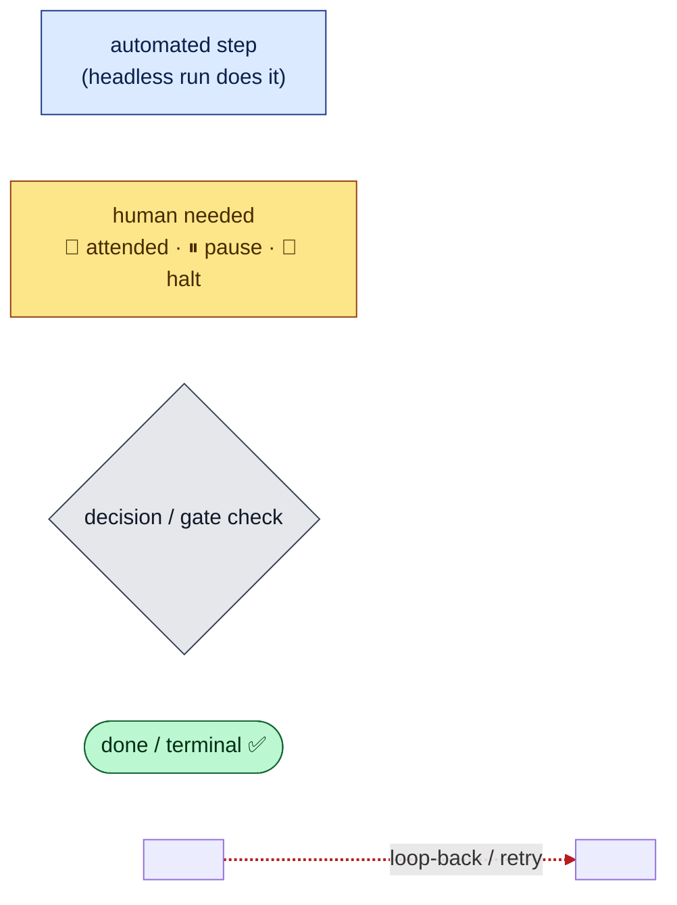
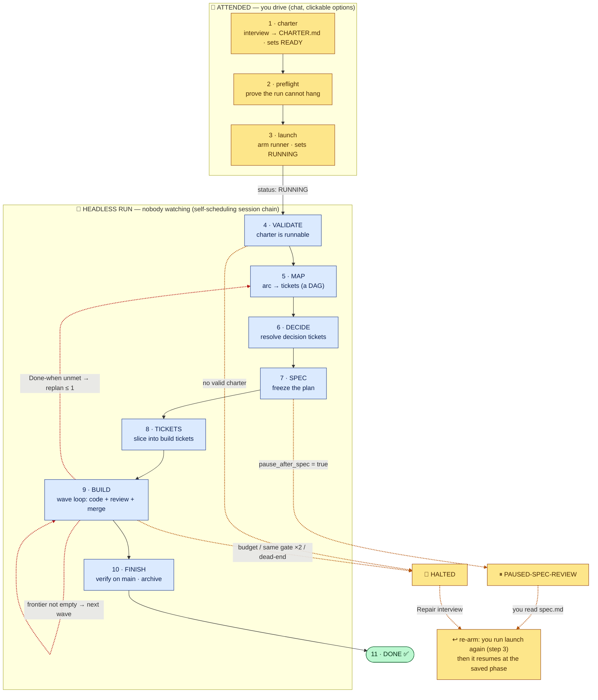
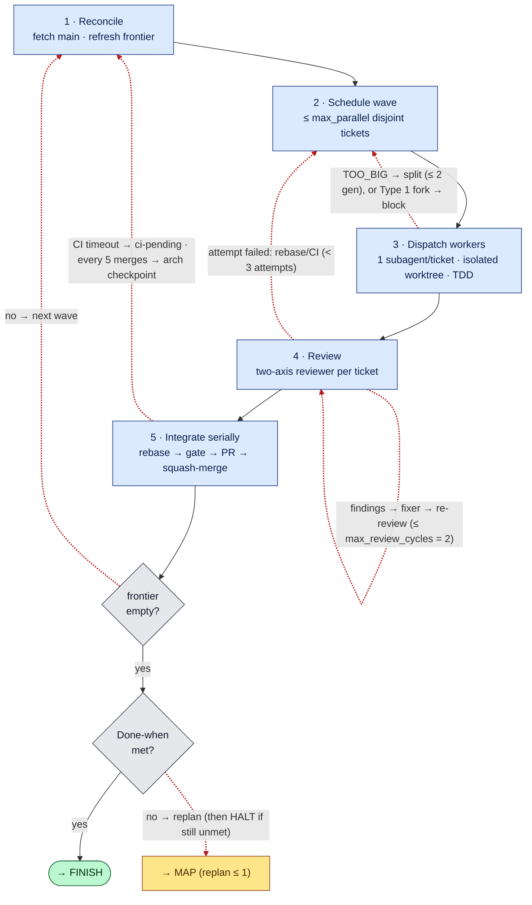
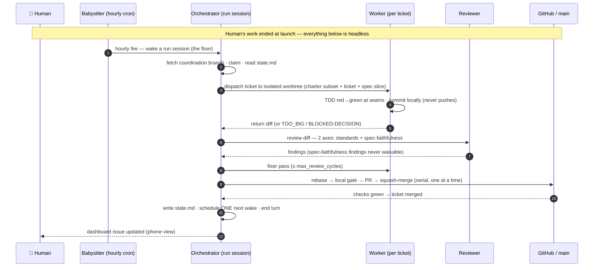
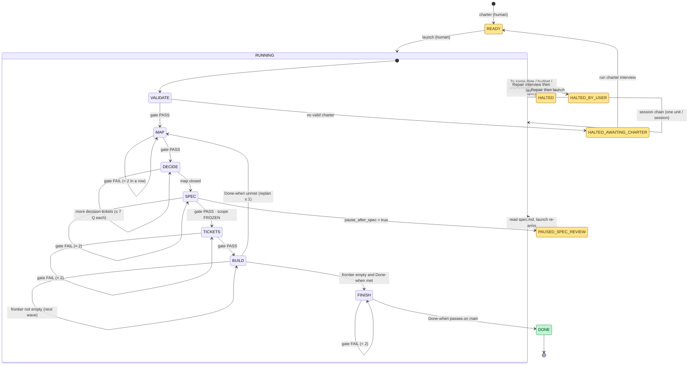
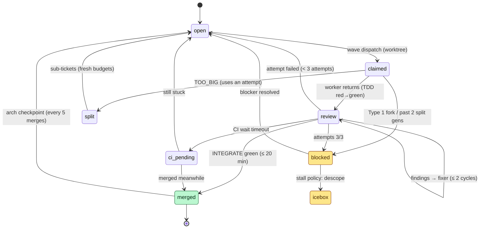
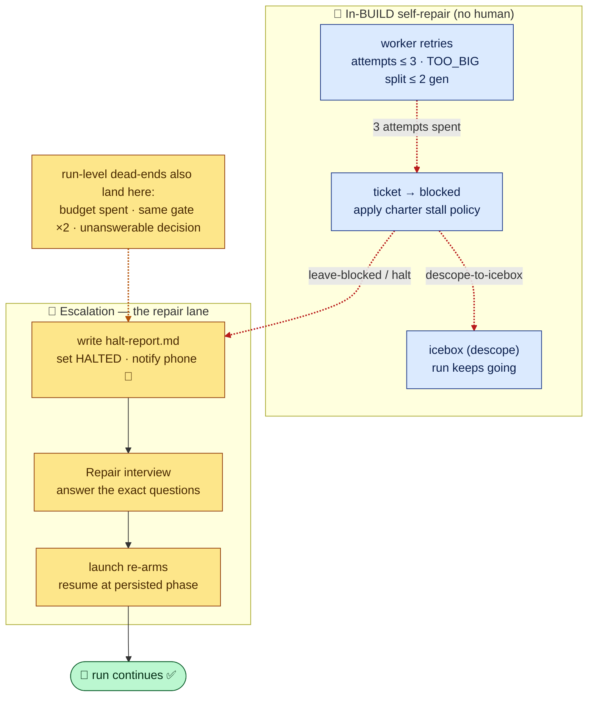

# The autopilot skill — a plain-language guide

> **What this is.** A self-contained explainer for the `autopilot` Claude Code
> skill: what it does, when to use it, and exactly how a run flows, step by step.
> Written for two readers at once — someone brand new to it, and the skill's own
> author who needs it precise. Technical terms are defined the first time they
> appear, and the **diagrams carry the order of operations** — you should be able
> to trace a run start-to-finish from the pictures alone.
>
> **This is reference material for humans.** It lives outside the skill on
> purpose. An agent *running* the skill should never read it — it reads
> `autopilot/SKILL.md` and the files under `autopilot/references/`. Every claim
> here is grounded in those files (and the postmortems in `docs/research/`); the
> source is cited where a claim isn't obvious, and the few things this guide had
> to infer are collected in the last section.

---

## 1 · In one paragraph

**Autopilot lets you hand Claude one well-defined chunk of project work and walk
away.** You spend an hour up front answering clickable questions in a chat, and
your answers become a written brief called a **charter**. From then on, Claude
works on its own — across many short, automatic sessions — turning that brief
into a plan, writing the code test-first, reviewing its own work with a fresh set
of eyes, and merging each piece into your project's main branch through normal
pull requests. It only interrupts you when it genuinely can't proceed safely; the
rest of the time you watch progress on your phone through a single status page.
When it's done (or when it gets stuck), it sends you a notification. The core
promise is modest and honest: **it never invents what you didn't tell it.** When
the charter is silent, it picks the safest, most easily-undone option — or it
stops and asks — rather than guessing at what you'd want.

---

## 2 · When to use it — and when not

Autopilot is built for **one well-scoped "arc" of work that would otherwise take
many sessions of your attention** — the kind of thing you'd be happy to find
finished (or safely paused) in the morning. Its own description
(`SKILL.md` frontmatter) names the trigger cases: *"work completed autonomously,
unattended, AFK, overnight, 'without me'."*

### Use it when

- The work is **well-defined enough to write down** — you can state what "done"
  looks like as commands that either pass or fail.
- It's **more than one sitting's worth** of work — several tickets, a build-out,
  a migration.
- You want it to **proceed while you're asleep or away**, checking in only when
  necessary.
- You're writing, renewing, or repairing a charter, or launching / resuming /
  pausing / checking on a run.

### Do NOT use it when

| Situation | Why not | Do instead |
| --- | --- | --- |
| **A small, single-session task** | The whole charter-and-chain apparatus is overhead you don't need. | Just do the task directly. (`SKILL.md`: *"Not for small single-session tasks — just do them directly."*) |
| **Anything that deploys to production** | This is a hard rail. Autopilot merges to your main branch through gated PRs, but it will not deploy, publish, or release. (`SKILL.md` Rails: *"never for anything that deploys to production"*; *"Never deploy, publish, or delete branches this run didn't create."*) | Keep deploys human-driven. |
| **The work isn't clear yet** | "Decision quality is capped by charter quality" (`SKILL.md`). A vague charter produces conservative, reversible defaults — or halts — not the thing you vaguely wanted. | Figure out what you want first (the charter interview will help), *then* launch. |

### 30-second decision aid

```
Is it a quick, one-off change?  ───────────────►  Just do it (skip autopilot).
        │ no
        ▼
Does it deploy / publish to production? ────────►  Do NOT use autopilot. Ever.
        │ no
        ▼
Can you write "done" as commands that pass/fail? ─►  no ─► Not ready. Clarify scope first.
        │ yes
        ▼
Is it more than one session's worth of work,
and do you want it to run while you're away? ────►  yes ─►  ✅ Autopilot is the right tool.
```

---

## 3 · Glossary

Plain-language definitions of the skill's real vocabulary. Each line ends with
*why it matters*.

**General terms first:**

- **Skill** — a packaged set of instructions Claude Code can load to do a
  particular kind of task. `autopilot` is one skill (its instructions live in
  `autopilot/SKILL.md`). *Why it matters: the whole thing is "just" a document
  Claude follows — there is no separate program.*
- **Agent / subagent** — an instance of Claude doing work. A **subagent** is a
  helper spawned with its own fresh, limited context to do one job (write a
  ticket, review a diff, audit a gate). *Why it matters: autopilot's quality
  comes from using many small, blinkered subagents instead of one that knows
  everything — a fresh reviewer catches what the author can't.*
- **Git branch** — a named line of development in the project's version history.
  Work happens on a branch and is merged into the main line when ready. *Why it
  matters: autopilot keeps all its bookkeeping on a dedicated branch so nothing
  touches your `main` until it's reviewed and merged.*
- **ADR (Architecture Decision Record)** — a short written note recording a
  significant, hard-to-reverse decision: what was chosen, why, and how you'd undo
  it. *Why it matters: autopilot writes an ADR for every one-way-door decision so
  the reasoning is auditable, not lost.*

**Autopilot's own vocabulary:**

- **Arc** — one well-defined chunk of project work, start to finish (e.g. "add
  CSV + XLSX export to the results table"). An autopilot run does exactly one arc.
  *Why it matters: the arc is the unit of everything — one charter, one
  coordination branch, one dashboard, one run.*
- **Charter** — the human-authored brief for an arc: destination, what "done"
  means, priorities, scope, no-touch zones, defaults for when the charter is
  silent, budgets. Written once, through an interview, before launch; **read-only
  during the run.** (`autopilot/references/charter-template.md`.) *Why it matters:
  it's the single source of truth the run reasons from — "the fixed oracle the
  whole run reasons from; its quality is the ceiling on the run"
  (`interview-guide.md`).*
- **Run mode vs. attended chat modes** — autopilot has six **modes**
  (`SKILL.md`). Five are **attended** (a human is present, driving via chat):
  `charter`, `preflight`, `launch`, `status`, `stop`. One is **headless** (`run`)
  — it does one unit of autonomous work with nobody watching, then schedules the
  next session and exits. *Why it matters: this split is the whole point — your
  judgment goes in during the attended modes; the headless run is pure mechanism.*
- **`docs/auto/` and the `auto/<arc>` branch** — all run state lives in the
  `docs/auto/` folder on a dedicated **coordination branch** named `auto/<arc>`
  (e.g. `auto/csv-export`). It's created at charter time, pushed at the end of
  every session, and fetched at the start of the next. *Why it matters: web
  sessions are throwaway — "origin is the program" (`SKILL.md`). The branch on
  the server is the run's only durable memory.*
- **`state.md`** — the run's "program counter": a single file recording
  `status:` (where the whole run stands) and `phase:` (which step it's in), plus
  budgets, claims, and trigger ids (`formats.md`). *Why it matters: every session
  starts by reading this file to know what to do next; it is never trusted from
  conversation memory.*
  - **`status`** values: `READY`, `RUNNING`, `PAUSED-SPEC-REVIEW`, `DONE`,
    `HALTED`, `HALTED-AWAITING-CHARTER`, `HALTED-BY-USER`.
  - **`phase`** values: `VALIDATE`, `MAP`, `DECIDE`, `SPEC`, `TICKETS`, `BUILD`,
    `FINISH`.
- **Gate** — a checklist that a phase must pass before the run advances, audited
  by a fresh-context subagent (the **Auditor**). Fail a gate and the phase loops
  back with the reason recorded (`SKILL.md`, `formats.md`). *Why it matters:
  gates are how the run police itself without a human — "done" has to be provable,
  not felt.*
  - **"Smoke gate" / smoke test** — a *smoke test* is a quick end-to-end check
    that the thing basically works (e.g. run the real export path over a 10k-row
    fixture and expect `csv:ok xlsx:ok` — `example-charter.md`). A charter can
    require one as a `Done-when` line or CI check. Note: "smoke gate" is **not**
    one of the formal phase gates; it's shorthand for "a smoke test used as a
    pass/fail check." (The "smoke-gate arc" in `docs/research/` was a real drill
    whose deliverable was wiring a smoke test into CI.)
- **HALT** — a **stop-and-wait state**: the run deliberately stops and waits for
  a human, having written down the exact questions to answer. "**Halting well is
  a success state**" (`SKILL.md`) — it's how the run refuses to guess. *Why it
  matters: a HALT is safe and resumable, never a crash or a wrong edit.*
- **The repair lane** — this guide's umbrella term for the **recovery path** when
  the run can't proceed: it writes a `halt-report.md`, sets a `HALTED` status,
  pings your phone, and waits; you answer via the **Repair interview**, then
  `launch` re-arms it and it resumes exactly where it stopped. (The skill files
  call the pieces "Repair," "halt-report," and "stall path"; "repair lane" is the
  convenient name for the whole loop.) *Why it matters: this is the escape hatch
  that makes unattended running safe.*
- **Worker (worker agent / subagent)** — a subagent that builds one ticket, alone,
  in an **isolated git worktree** (its own private checkout of the code). It
  writes tests and code, commits locally, and **never pushes or reviews its own
  work** (`playbooks.md` §3). *Why it matters: isolation lets several tickets be
  built in parallel without stepping on each other.*
- **The babysitter** — an **hourly, fresh-session scheduled task** (a "Routine")
  that the human creates once, by hand, at launch. Each hour it wakes a brand-new
  session that does one unit of work if the run has stalled, or sees a finished
  state and exits. It is the **guaranteed floor** that keeps an unattended run
  moving. (`operations.md`.) *Why it matters: the fast "chain" of sessions needs a
  human to approve each scheduling call, so the babysitter is what actually
  carries a run through the night. It watches the whole **run**, not individual
  workers.*
- **"Fresh session" / materialization** — a **fresh session** is a brand-new,
  empty Claude Code web container (a fresh clone of the repo).
  **Materialization** is the platform actually spinning that container up and
  running the prompt. A documented platform bug means scheduled fresh sessions
  created *by tool* fire but never materialize, while ones created *by hand in the
  web dashboard* do work — which is why the babysitter is hand-created
  (`docs/research/2026-07-28-routine-fresh-session-materialization.md`). *Why it
  matters: it's the reason for the exact launch ritual you'll be asked to follow.*
- **Tracer-bullet ticket** — a ticket that cuts a **narrow but complete** path
  through every layer it touches (schema → logic → API → UI → tests), so it's
  demoable and mergeable on its own, rather than a horizontal "do all the schema
  first" slab (`playbooks.md` §2). *Why it matters: each ticket lands as a
  working, shippable slice — `main` never sits half-built.*
- **TDD "at seams"** — **Test-Driven Development** means writing a failing test
  first, then the minimal code to pass it (red → green). A **seam** is a public
  boundary tests observe behavior through (e.g. a function's signature, a
  component's props). "At seams" means tests are written **only** at the seams
  agreed in the spec — never against internal details (`playbooks.md` §3). *Why it
  matters: seam-only tests survive refactoring and prove real behavior, so the
  test suite is trustworthy evidence rather than brittle noise.*
- **Two-axis review** — every built ticket is reviewed by a fresh subagent along
  **two axes at once**: **Standards** (does it follow the repo's coding standards
  + a code-smell baseline?) and **Spec-faithfulness** (does it do exactly what the
  ticket asked — no more, no less?). Spec-faithfulness findings can never be
  waived (`playbooks.md` §4). *Why it matters: it separates "is this good code"
  from "is this the right code," and catches scope creep.*
- **The Pocock spine** — the engineering process autopilot follows, adapted from
  Matt Pocock's workflow: **grill → spec → tracer-bullet tickets → TDD at agreed
  seams → two-axis review** (`SKILL.md`). "Grill" means interrogating a plan for
  weaknesses. *Why it matters: it's the backbone that maps onto the phases —
  DECIDE (grill), SPEC, TICKETS, BUILD (TDD + review).*

---

## 4 · The big picture

**Read this diagram before anything else.** It's the whole run, in order. The
numbered spine (1 → 11) is the happy path, top to bottom. The two coloured groups
show the crucial split: **the amber block at top is you** (attended chat), **the
blue block is the machine** (the headless run). Branches for pausing and halting
peel off to the side.

**The one visual language, used in every diagram in this guide:**



- **Blue rectangle** = an automated step (the headless run does it).
- **Amber rectangle** (with 👤 / ⏸ / 🛑) = a human is needed: an attended mode, a
  pause, or a halt.
- **Grey diamond** = a decision or gate check.
- **Green rounded** = done / terminal success.
- **Red dashed edge** = a loop-back or retry. **Amber dashed edge** = handing
  control to a human and back.

### The anchor: one run, start to finish



**Walking through it.** You do steps **1–3** in chat: write the **charter**
(sets `status: READY`), run **preflight** to prove the run can't hang, then
**launch** (sets `status: RUNNING`) — which arms the runner and hands off to the
machine. From there the headless run marches down the spine: **VALIDATE** the
charter → **MAP** the arc into tickets → **DECIDE** the open questions → freeze
the **SPEC** → slice into build **TICKETS** → **BUILD** them wave by wave → run
**FINISH** checks → **DONE**. Two loop-backs (red) live inside BUILD: it repeats
waves until the ticket list ("frontier") is empty, and if the work is done but the
charter's "done-when" tests still fail, it can replan once (back to MAP). Two
exits peel off to a human (amber): if the charter opted in, it **pauses** after
SPEC for you to read the plan; and any dead-end **halts**. Both hand back to you,
and re-running `launch` resumes the run at the exact phase it stopped in.

---

## 5 · Step by step

One subsection per mode/phase. **Attended** subsections need you present;
**headless** ones run themselves.

### 👤 charter — *attended* (write the brief)

- **What happens:** an interview. Claude first does read-only **recon** of the
  repo (test counts, CI commands, conventions), then asks ~25 questions — each a
  clickable prompt with honest pros/cons per option and a recommendation — across
  sections: Destination, Done-when, Priorities, Scope (in *and* an adversarial
  "what would you hate an eager agent to add?"), No-touch zones, Silence-defaults,
  Stall policy, Budgets, Merge & CI, Quality invariants, Tech constraints,
  Glossary. Each section is **read back** to you verbatim before the next; the
  whole charter is confirmed at the end. (`interview-guide.md`.)
- **Who:** you decide everything; the agent supplies recon, structure, options,
  and persistence. *"The human makes every decision; the agent supplies recon,
  structure, options."*
- **Inputs:** your goals; the repo.
- **Outputs:** `docs/auto/CHARTER.md`, `docs/auto/charter-interview.md` (the
  transcript with provenance tags), and `state.md` initialized to
  `status: READY` — the one and only state edit charter mode is allowed to make.
- **Sub-modes:** **New** (full interview), **Renewal** (a new arc reusing stable
  sections from a finished one), **Repair** (answer only the questions a HALT
  raised).
- **Hard rule:** refuses to run headless. If nobody can answer, it prints one
  line and exits — it never fills in a charter itself.

### 👤 preflight — *attended* (prove it can't hang)

- **What happens:** a checklist run **in the same kind of session the run will
  use**, to catch anything that would strand an unattended run: skills are
  correctly provisioned, the charter passes its VALIDATE checks, git push works,
  GitHub tools work and a PR can be created, the test suite is **green in this
  container** (catching missing env vars — "the classic overnight killer"), and
  the scheduling **canary** runs to see which runner lane this account supports.
  (`operations.md`.)
- **Outputs:** a pass/fail report per line; on a full pass it offers `launch`.
- **Why it's separate:** it writes no status — it only decides, socially, whether
  launch is safe.

### 👤 launch — *attended* (arm the runner, hand off)

- **What happens:** confirms the arc name, repo, budgets, and merge policy back to
  you **verbatim** (one click), creates the **dashboard issue** (the live status
  page for your phone), runs the canary, arms the runner (see §6), sets
  `status: RUNNING`, re-stamps the `launched:` clock, pushes, and tells you what
  to expect. It also **prints a babysitter prompt for you to paste** into the
  web Routines dashboard by hand.
- **Outputs:** dashboard issue; armed runner + babysitter; `status: RUNNING`.
- **Also the re-arm path:** after a HALT-repair or a spec pause, `launch` is what
  resumes the run — same steps, minus creating things that already exist.

### 🤖 VALIDATE — *headless* (is the charter runnable?)

- **What happens:** the Auditor checks the charter is present, its sentinel line
  is gone, every `Done-when` line actually **runs** (an unmet result is fine — it
  just defines the finish line), priorities are strictly ranked, budgets are
  numeric, no-touch zones are listed. Records baselines. (`SKILL.md`,
  `formats.md`.)
- **Decision:** valid → **MAP**. Missing/invalid charter in a headless session →
  `HALTED-AWAITING-CHARTER` + notification (you then run the charter interview
  from any device).

### 🤖 MAP — *headless* (chart the arc as tickets)

- **What happens:** the arc is charted as session-sized **tickets** with blocking
  edges forming a **DAG** (a dependency graph with no cycles). Tickets are typed:
  **research** (find facts from primary sources), **decision** (resolved later by
  the Decision Protocol), **prototype** (throwaway code to answer a design
  question), **task** (mechanical setup), **build** (a feature slice).
- **Gate:** every charter "Scope-In" item maps to a ticket or a cited icebox
  entry; edges form a DAG.

### 🤖 DECIDE — *headless* (resolve the open questions)

- **What happens:** decision tickets are worked one per session via the **Decision
  Protocol** (§6), fed by research and prototype tickets. The loop closes when
  every node on the map is closed.
- **Bound:** at most `max_griller_questions` (default 7) per ticket.

### 🤖 SPEC — *headless* (freeze the plan)

- **What happens:** a `spec.md` is synthesized from the closed map + decisions:
  pre-agreed **TDD seams**, an **executable acceptance criterion** for every
  requirement, nothing outside charter scope. A red-team subagent attacks it
  first. (`playbooks.md` §1.)
- **Gate:** line-by-line charter traceability; seams named. **After this gate,
  scope is FROZEN** — new ideas go to the icebox, never the plan.
- **Optional pause:** if the charter set `pause_after_spec: true`, the run enters
  `PAUSED-SPEC-REVIEW` and pings you to read the frozen spec before it builds.

### 🤖 TICKETS — *headless* (slice into buildable work)

- **What happens:** the spec is sliced into **tracer-bullet vertical slices** —
  each one-session-sized, independently mergeable (feature-flagged where needed),
  with acceptance lines copied verbatim from the spec, `touches:` hints, and
  `seams:` listed. A "mergeability skeptic" subagent attacks the independence
  claims. (`playbooks.md` §2.)
- **Gate:** sizes, DAG, independent mergeability.

### 🤖 BUILD — *headless* (the wave loop — the heart of the run)

BUILD runs in **waves**. Each wave repeats five steps until the ticket list is
empty:



1. **Reconcile** — fetch `origin/main`, resolve any pending PRs, refresh the
   **frontier** (the tickets whose dependencies are all merged).
2. **Schedule the wave** — pick up to `max_parallel` frontier tickets, preferring
   ones that touch **disjoint** files (so they can't conflict). Overlap → smaller
   wave, down to one.
3. **Dispatch workers** — one worker subagent per ticket, each in its own
   isolated worktree cut from `origin/main`, running the TDD loop (red → green at
   the ticket's seams only, red-run evidence logged, no refactoring inside the
   loop). Workers commit locally and **never push**.
4. **Review** — a fresh reviewer subagent per returned ticket runs the two-axis
   review; findings go to a **fixer** pass in the worker's worktree, then
   re-review, up to `max_review_cycles` (default 2).
5. **Integrate serially** — one ticket at a time (the single-writer rule): rebase
   onto current `origin/main`, run the full local gate on the rebased result,
   push the branch, open a PR, wait for checks (≤ `ci_wait_minutes`),
   **squash-merge**, delete the branch, close the ticket, update the dashboard.

Along the way: a ticket that's too big trips the **`TOO_BIG`** tripwire and is
split (≤ 2 generations); a ticket that hits a one-way-door decision **blocks** and
spawns a decision ticket; each ticket gets **3 attempts** before it's marked
`blocked`; and every `arch_checkpoint_every` (default 5) merges, an
**architecture checkpoint** scans the touched code for improvements. When the
frontier empties, BUILD checks the charter's `Done-when`: met → **FINISH**; unmet
→ one **replan** (back to MAP); still unmet after that → **HALT**.

### 🤖 FINISH — *headless* (verify and archive)

- **What happens:** full test sweep + **every charter `Done-when` command run
  against `main` itself**; an end-of-arc architecture pass (findings → icebox for
  the next arc); a completion report; the `docs/auto/` contents are moved to
  `archive/<arc>/` and opened as **one small docs PR** to main; the Routines are
  disabled; the dashboard is finalized; `status: DONE` (notification fires).

### 👤 status / stop — *attended* (check in / kill switch)

- **status** (either attended or headless): a read-only report — phase, wave,
  tickets, budgets, last events. Changes nothing.
- **stop** (attended): the graceful kill switch. Re-reads state first, sets
  `status: HALTED-BY-USER`, writes a mini halt-report, disables the chain
  trigger(s), tells you to remove the babysitter by hand, and updates the
  dashboard. Honored immediately, at any point.

---

## 6 · Who's who

A run session is an **orchestrator** that spawns short-lived **subagents**, each
with a deliberately narrow view. Curating what each role may read is a feature:
*"curated-small beats comprehensive-large"* (`playbooks.md`). Separately, an
external **babysitter** keeps the whole run alive.

| Role | Phase(s) | What it may read | Its job |
| --- | --- | --- | --- |
| **Orchestrator** | all | state, charter, the tickets it's acting on | Runs the session: claims the run, dispatches workers, mediates the Decision Protocol, integrates serially, writes state back, schedules the next wake. |
| **Auditor** | every gate | the gate checklist + charter + ledger (fresh context) | Runs each phase gate PASS/FAIL; countersigns waivers and restated decisions. |
| **Griller** | DECIDE | the decision ticket + map/spec-so-far + linked notes | Asks one evidence-bearing question at a time; bounces fact-questions to research. |
| **Decider** | DECIDE (+ mid-build, checkpoint triage) | **only** CHARTER.md + decisions.md + the question | Answers from, in strict order: the ledger → the charter → the charter's silence-defaults. Applies the reversibility test (Type 2 vs Type 1). |
| **Red-team** | SPEC, TICKETS, DECIDE (Type 1) | the spec / ticket / draft ADR | Argues the strongest case *against* — the "mergeability skeptic" in TICKETS, the spec red-team in SPEC, the ADR adversary in DECIDE. |
| **Worker** | BUILD | a charter subset + its one ticket + the spec slice (never the run history) | Builds one ticket TDD-style in an isolated worktree; commits locally; never pushes or reviews its own work. |
| **Reviewer** | BUILD | the diff + the ticket + `codingstandards.md` + smell baseline (never the worker's transcript) | Two-axis review (Standards + Spec-faithfulness) + test policing. |
| **Fixer** | BUILD | the worker's worktree + review findings | Applies the review findings, post-green. |
| **Architecture scanner** | checkpoint / FINISH | the touched paths | Finds "deepening opportunities"; findings triaged by the Decider. |
| **Babysitter** *(external, not a subagent)* | whole run | origin state, each hour | An hourly fresh session that keeps the run moving (see below). |

### How they hand off (one BUILD wave)



### The babysitter, in plain terms

Web sessions can't schedule their own next session without a human tapping
"approve" on every scheduling call — that's a platform rule autopilot can't change
(`docs/research/2026-07-29-scheduling-tool-approval-policy.md`). So autopilot runs
on **two lanes at once**:

- **The chain** (fast, opportunistic): each session tries to schedule the next
  one a few minutes out. This only works while a human is around to approve the
  tap — so it's a bonus, not a guarantee.
- **The babysitter** (slow, guaranteed): an **hourly** scheduled task that fires a
  **fresh session** whether or not anyone's home. Each fire re-reads the state
  from the server and does one unit of work — or, if the chain wedged, adopts the
  run and takes over; or, if the run is finished, sees the terminal state and
  exits. It's created *by hand* in the web dashboard because tool-created ones
  don't materialize (§3).

So **what does the babysitter watch, and what power does it hold?** It watches the
**run as a whole**: is it still progressing? It has power over the **run** — it
can start a fresh session, adopt a stale claim and resume a dead chain, and if it
resumes repeatedly *without* the state changing (`no_progress_sessions`, default
3), that trips a HALT so a stuck run can't spin forever. What it does **not** do
is reach inside a running worker — it doesn't supervise the coding. The roles with
power over an individual worker are the **orchestrator** (which dispatches
workers, splits a `TOO_BIG` one, bounds it to 3 attempts, and blocks it) and the
**reviewer** (which can block a ticket from merging). The babysitter is the
watchdog over the *process*, not the *programmer*.

### The Decision Protocol (grilling with nobody home)

DECIDE deserves a closer look because it's how autopilot makes judgment calls
without you. Self-grilling is banned — "an agent answering its own questions
launders its own assumptions" (`SKILL.md`) — so the work is split across separate
subagent contexts: the **Griller** poses one evidence-bearing question; the
**Decider** (which can see only the charter + ledger) answers from the ledger,
then the charter, then the charter's silence-defaults, in that strict order. If
all three are silent, it applies the **reversibility test**: a **Type 2** decision
(a two-way door — undoable within one ticket) is picked by the charter's ranked
priorities and logged in one line; a **Type 1** decision (anything harder to undo)
requires research (and sometimes a prototype), gets a full **ADR** with rollback
notes, is attacked by a **Red-team**, and is countersigned by the **Auditor**.
Anything that can't be answered safely becomes a HALT with the question phrased
for you.

---

## 7 · Where it pauses

Every point the run stops for a human, straight from the state machine
(`flow.md`). All are **safe and resumable** — the state on the server records
exactly where it stopped.

| Stop | Status | Trigger | What *you* do to continue |
| --- | --- | --- | --- |
| **Spec review** *(pause)* | `PAUSED-SPEC-REVIEW` | The charter set `pause_after_spec: true` and SPEC just passed its gate. | Read `spec.md` on GitHub (from your phone). Re-run `launch` to re-arm; it resumes at the persisted phase. |
| **No charter** *(halt)* | `HALTED-AWAITING-CHARTER` | VALIDATE found the charter missing or invalid in a headless session. | Run the `charter` interview from any device; it sets `status: READY`, then `launch`. |
| **Out of road** *(halt)* | `HALTED` | Two consecutive failures of the same phase gate; **or** a budget is spent (`max_sessions`, `max_hours`, or `no_progress_sessions`); **or** a decision can't be answered safely / the state schema is unknown; **or** the frontier emptied with `Done-when` still unmet after the one replan. | Run `/autopilot` — at a HALTED state it offers the **Repair interview** (answers the exact `halt-report.md` questions), then `launch`. Resumes at the persisted phase. |
| **You stopped it** *(halt)* | `HALTED-BY-USER` | You ran `stop`. | Whenever you like, `/autopilot` offers Repair → `launch` to resume. |

Two things to remember: **halting well is a success state** — a HALT is the run
refusing to guess, not a failure — and the `halt-report.md` it leaves carries the
exact questions phrased so the Repair interview can ask them verbatim
(`formats.md`).

---

## 8 · Where it loops

Every repeating cycle in the run is **bounded**, and every bound is enforced in
`state.md`. The skill states the invariant outright: *"Every loop is bounded and
every bound is enforced in state.md; exhausting any budget takes the stall path,
never silent continuation"* (`SKILL.md`) — that stall path is the anti-infinite-
loop safeguard: run out of any budget and it HALTs rather than spinning.

| Loop | What starts it | What ends it (happy) | Anti-infinite-loop bound |
| --- | --- | --- | --- |
| **Session chain** | `status: RUNNING`; each session schedules one next wake | Reaching a terminal status | `max_sessions` (60), `max_hours` (optional), `no_progress_sessions` (3) → HALT |
| **Phase-gate retry** (MAP/SPEC/TICKETS/FINISH) | A gate fails; phase loops back with the reason recorded | The gate passes | `consecutive_same_gate_failures` (2) → HALT |
| **Decision grilling** (DECIDE) | Open decision tickets on the frontier | The map closes (all nodes closed) | `max_griller_questions` (7) per ticket |
| **Build wave loop** (BUILD) | Frontier not empty | Frontier empty | Bounded by ticket exhaustion; empties or replans |
| **Replan** | Frontier empty but `Done-when` unmet | `Done-when` met, or replan budget spent | `replans` (1) → then HALT |
| **Review fix rounds** (per ticket) | Reviewer findings | Clean review | `max_review_cycles` (2) |
| **Ticket attempts** (per ticket) | Rebase conflict / CI red / failed attempt | Ticket merges | `max_attempts_per_ticket` (3) → `blocked` |
| **`TOO_BIG` splits** (per ticket) | Ticket too big to finish | Sub-tickets fit | `split_generations` (2) → `blocked` |
| **CI wait / flake rerun** | PR checks pending / a flaky failure | Checks green | `ci_wait_minutes` (20); `flake_reruns` (1) |
| **Architecture checkpoint** | `arch_checkpoint_every` merges reached | Findings triaged | ≤ 1 refactor ticket per checkpoint |

### The run state machine (faithful to `flow.md`)

These two diagrams reproduce the real states and transitions from `flow.md`
(recoloured to this guide's legend; the states and edges are unchanged). The
first is the run-level view — statuses and phases. The second zooms into a single
ticket's life inside BUILD, where the tightest loops live.

**Run level — statuses (amber = human needed, green = done) and phases:**



**Ticket level — a single ticket's life inside BUILD** (green = merged, amber =
stuck):



> **One subtlety worth knowing** (from `flow.md`'s own audit): the "two failures
> of the same gate → HALT" rule applies to **phase** gates only (MAP, SPEC,
> TICKETS, FINISH). A ticket's per-ticket INTEGRATE check failing does **not**
> count toward that HALT — it just burns one of that ticket's 3 attempts.

---

## 9 · A worked example

Two real runs from `docs/research/` make the machine concrete. The first shows the
happy path; the second shows a HALT and recovery. Numbers are from the
postmortems.

### Run A — csv-export (the happy path, no halts)

*(`docs/research/2026-07-29-csv-export-arc-postmortem.md`)*

1. **charter** *(attended, ~00:30Z):* a human interviews to a charter for adding
   CSV+XLSX export to a results table — outcomes, `Done-when` commands, blunt
   scope-out, `pause_after_spec: true` for a first run. Charter + interview
   transcript pushed to `auto/csv-export`; `status: READY`.
2. **launch** *(attended, 01:12Z):* dashboard issue #2 created, chain armed,
   babysitter pasted in, `status: RUNNING`, `launched: 01:12Z`.
3. **VALIDATE → MAP → DECIDE → SPEC** *(headless, 01:45–03:40Z):* Auditor passes
   VALIDATE 4/4; the arc is mapped; **16 decisions** are made (fed by research and
   a prototype ticket); the spec is synthesized and passes its gate 5/5. Scope
   frozen.
4. **⏸ PAUSED-SPEC-REVIEW** *(~03:40–04:45Z):* because the charter opted in, the
   run pauses; the human reads `spec.md` on their phone (~1 h) and re-arms via
   `launch`. *(This is a HALT-adjacent pause — a handoff, then resume.)*
5. **TICKETS** *(headless):* the gate **catches a real defect** — ticket #07
   pinned "= 80 total tests" while #06 allowed "≥ 12," a coupling that would cause
   spurious failures — and fixes it before BUILD.
6. **BUILD** *(headless):* **wave 1** builds #06 solo; **wave 2** builds #07 ∥ #08
   in parallel (disjoint touches). Each ticket: worker → reviewer → fixer →
   serial integrate → squash-merged PR. **8 tickets, all first-attempt.** The
   babysitter carries the overnight tail at ~1 unit/hour.
7. **FINISH → DONE** *(07:00Z):* all 5 `Done-when` lines re-verified against
   `main`; archive PR #7 merged; dashboard closed ✅.

**Result:** charter → merged-on-main with **zero mid-run human decisions**; the
only human touches after launch were optional approval taps and the deliberate
spec pause. 11/40 sessions, ~5.8 h wall clock.

### Run B — smoke-gate (a deliberate HALT, then repair)

*(`docs/research/2026-07-29-smoke-gate-repair-drill.md`)*

This run was chartered (via **Renewal**) with a deliberately starved budget
(`max_sessions: 2`) to exercise the repair lane on purpose:

1. **charter (Renewal) → launch → VALIDATE → MAP** run normally.
2. **🛑 HALT:** with only 2 sessions allowed, the run hits the scheduling guard
   and **halts benignly** rather than overrunning its budget. It writes
   `halt-report.md` (with the exact question — raise the budget — its evidence,
   and a resume line), retitles the dashboard 🛑, and **@-mentions the owner** so
   the phone buzzes.
3. **Repair:** the human opens `/autopilot` at the HALTED state → the **Repair
   interview** asks only the halt-report's question; the answer is appended under
   a dated `# appended after HALT` comment to the charter's `§Budgets`.
4. **Re-launch:** `launch` re-arms; `HALTED → RUNNING`, `launched:` re-stamped,
   and the run **resumes at the persisted phase** — the session counter continues
   (3/12), it does not restart from VALIDATE.
5. **SPEC → TICKETS → BUILD → FINISH → DONE:** the one build ticket merges on its
   first attempt (PR #10), the archive PR (#11) merges, all `Done-when` lines pass
   against `main`.

**The measured price of a benign halt:** one phone notification, one clickable
question, ~2 minutes of human time — after which the run resumed exactly where it
stopped.

### And a loop firing (from a third run)

In the **xlsx-export** run
(`docs/research/2026-07-30-validation-program-capstone.md`), the **two-axis
review loop** earned its keep: the reviewer caught a real shipping bug — a hollow
chunk loop that would freeze the UI on a 10k-row export and that naive tests
passed — which went to a **fixer pass and re-review** (the `review → review` loop
in the ticket diagram) before the ticket was allowed to merge. That's the loop in
§8 doing exactly its job: catching wrong-but-plausible code before it reaches
`main`.

---

## 10 · When things go wrong

Autopilot's design principle is that **every failure fails safe** — a report, a
refusal, or a clean halt, never a wrong edit to `main`. Across four validation
runs, that held every time (`docs/research/2026-07-30-validation-program-capstone.md`).
Here's how it recovers, from smallest to largest.



**Common failure modes and the recovery:**

- **A worker gets a ticket wrong** → the reviewer catches it; the fixer fixes it;
  re-review (up to 2 rounds). No human.
- **A ticket is too big to finish** → the `TOO_BIG` tripwire fires; the worker
  commits WIP and proposes a split; sub-tickets get fresh budgets (up to 2 split
  generations). No human.
- **A worker hits a one-way-door decision mid-build** → it returns
  `BLOCKED-DECISION`; the ticket blocks and a decision ticket is spawned to
  resolve it. No human (the Decision Protocol handles it, or escalates).
- **A ticket keeps failing** (rebase conflicts, CI red) → up to 3 attempts, then
  marked `blocked` and the charter's **stall policy** applies:
  `descope-to-icebox` (the run keeps going without that ticket) or `leave-blocked`
  (escalate). No human unless the policy says to halt.
- **CI is red because of pre-existing breakage on `main`** → recorded, the
  charter's stance applied, attempts **not** burned on it.
- **A session crashes mid-work** → the claim/push protocol makes it harmless; the
  babysitter resumes it next hour. Repeated resume-without-progress trips the
  no-progress HALT.
- **The run genuinely can't proceed** (budget spent, same gate failing twice, an
  unanswerable decision, `Done-when` unmet after replan) → the **repair lane**:
  `halt-report.md` + `HALTED` + a phone notification, then **you** answer via the
  Repair interview and `launch` resumes it.

The escalation ladder, in one line: **fixer → attempts → split → block → stall
policy (icebox or halt) → HALT → you.**

---

## 11 · Cheat sheet

**The modes** *(attended = you present · headless = nobody watching)*

| Mode | Attended? | Does |
| --- | --- | --- |
| `charter` | ✅ | Interview → CHARTER.md; sets `READY`. |
| `preflight` | ✅ | Prove the run can't hang. |
| `launch` | ✅ | Arm runner + babysitter; sets `RUNNING`. Also the re-arm path. |
| `run` | ❌ headless | One unit of work, then schedule next + exit. |
| `status` | either | Read-only report. |
| `stop` | ✅ | Kill switch; sets `HALTED-BY-USER`. |

**The phases, in order** (headless):
`VALIDATE → MAP → DECIDE → SPEC → TICKETS → BUILD → FINISH → DONE`

**The BUILD wave, in order:**
`Reconcile → Schedule → Dispatch workers → Review → Integrate serially`

**Where it stops for you:**
`PAUSED-SPEC-REVIEW` (opt-in spec read) · `HALTED-AWAITING-CHARTER` (no charter) ·
`HALTED` (out of road) · `HALTED-BY-USER` (you stopped it). **Halting well is a
success state.**

**Default budgets** (all charter-overridable):
`max_sessions 60 · max_parallel 3 · max_attempts_per_ticket 3 ·
max_review_cycles 2 · max_griller_questions 7 · replans 1 ·
consecutive_same_gate_failures 2 · ci_wait_minutes 20 · flake_reruns 1 ·
arch_checkpoint_every 5 · split_generations 2 · max_session_minutes 90 ·
pause_after_spec false`

**Key terms in one breath:** an **arc** is the job · the **charter** is the brief ·
**`state.md`** is the program counter · a **gate** is a pass/fail checklist · a
**worker** builds one ticket in isolation · **two-axis review** = standards +
spec · the **babysitter** is the hourly floor that keeps it moving · a **HALT** is
a safe stop-and-wait · the **repair lane** is how you un-stick it.

**Two hard rails:** never for small tasks; **never anything that deploys to
production.**

---

## 12 · What I wasn't sure about

Everything above is grounded in the skill files and the `docs/research/`
postmortems. The honest caveats:

1. **"Smoke gate" is not a formal gate.** The task named it as an example gate,
   but the skill's real gates are `VALIDATE / MAP / SPEC / TICKETS / INTEGRATE /
   DONE` (`formats.md`). "Smoke gate" appears only as (a) a smoke-test `Done-when`
   line in `example-charter.md` and (b) the *name of a drill arc* in
   `docs/research/`. I've defined it as "a smoke test used as a pass/fail check,"
   which is faithful to those uses — but if you meant a distinct mechanism, it
   isn't one in the files.

2. **"Repair lane" is my umbrella term, not skill vocabulary.** The files call the
   pieces "Repair" (a charter sub-mode / interview), "halt-report.md," and "the
   stall path." I've grouped them under "repair lane" for readability and said so.

3. **The babysitter's "power over a worker."** The Phase-1 brief asked what power
   the babysitter has *over a worker*. Per the files, the babysitter's power is
   over the **run/chain** (start, resume, adopt a stale claim, trip the
   no-progress HALT), **not** over individual worker subagents. The roles with
   direct power over a worker are the **orchestrator** and the **reviewer**. I
   wrote it that way for accuracy; flagging it here in case the intended framing
   was different.

4. **A couple of transitions are inferred in `flow.md` itself, not stated
   verbatim in `SKILL.md`.** `flow.md` labels these with footnotes, and I carried
   its reading:
   - **`BUILD → FINISH`** (frontier empty *and* `Done-when` met) is inferred as
     the complement of the documented "unmet → replan → HALT" path.
   - **`blocked → open`** (a blocked ticket re-opening once its blocker resolves)
     is a paraphrase composed from "refresh the frontier" and how dependents
     unblock; attempts-exhausted blocked tickets have no documented path back to
     `open` except the human Repair path.

5. **Lane B (tool-scheduled fresh-session chain) is documented but unavailable on
   the skill's home account** due to an upstream platform bug
   (`anthropics/claude-code#54260`), so in practice the runner is the **Lane A
   chain + hand-created babysitter**. I described the working reality; the skill
   also documents the canary that would detect if Lane B ever starts working.

6. **Some rare paths are documented but "harness-only" (never yet exercised in a
   real run)** per the capstone: the replan path, a rebase-conflict retry-solo, a
   CI-red diagnose/fix loop, the `ci-pending` timeout, and an architecture
   checkpoint *inserting* a refactor ticket. They're in the state machine and I've
   described them from the files, but they're less battle-tested than the happy
   path.

7. **Diagram fidelity.** The §8 state diagrams reproduce `flow.md`'s real states
   and transitions but are **recoloured** to this guide's single legend and have
   **condensed guard labels** for readability; `flow.md` is the authoritative,
   fully-annotated source (with per-edge traceability) if you need the exact
   wording. I rendered every diagram in this guide with a Mermaid renderer and
   eyeballed each one for legibility before committing.

---

*Sources: `autopilot/SKILL.md`, `autopilot/references/{flow,playbooks,operations,formats,interview-guide,charter-template,example-charter}.md`, and `docs/research/2026-07-{28,29,30}-*.md`. This guide is descriptive reference material for humans and is intentionally kept outside `autopilot/` so the skill never loads it at runtime.*
